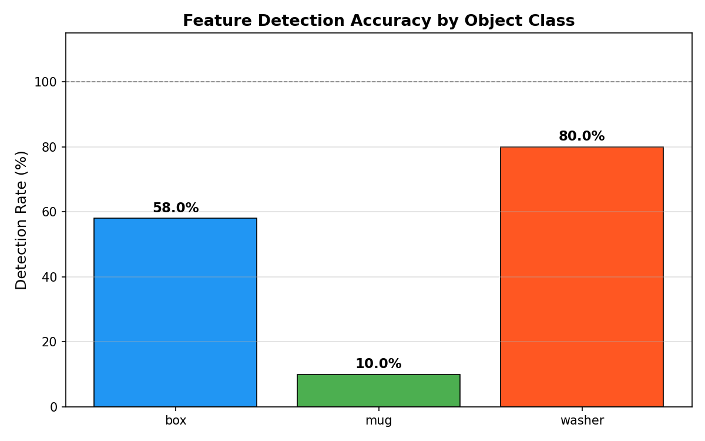
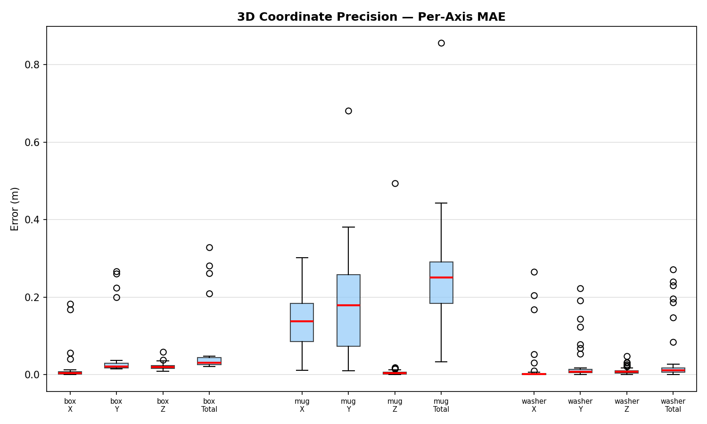
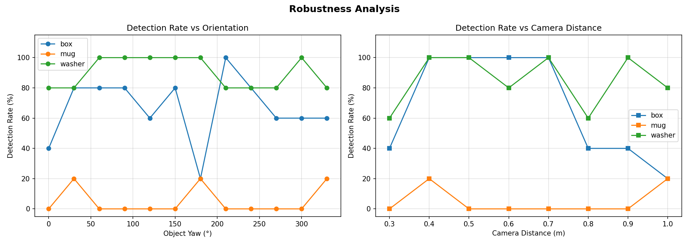
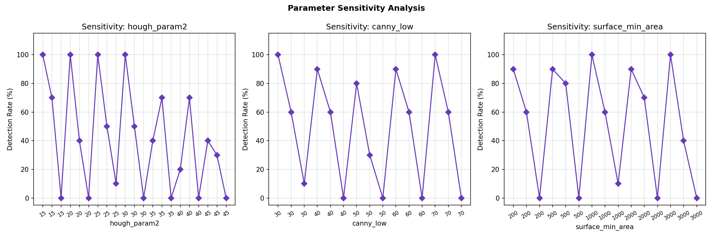
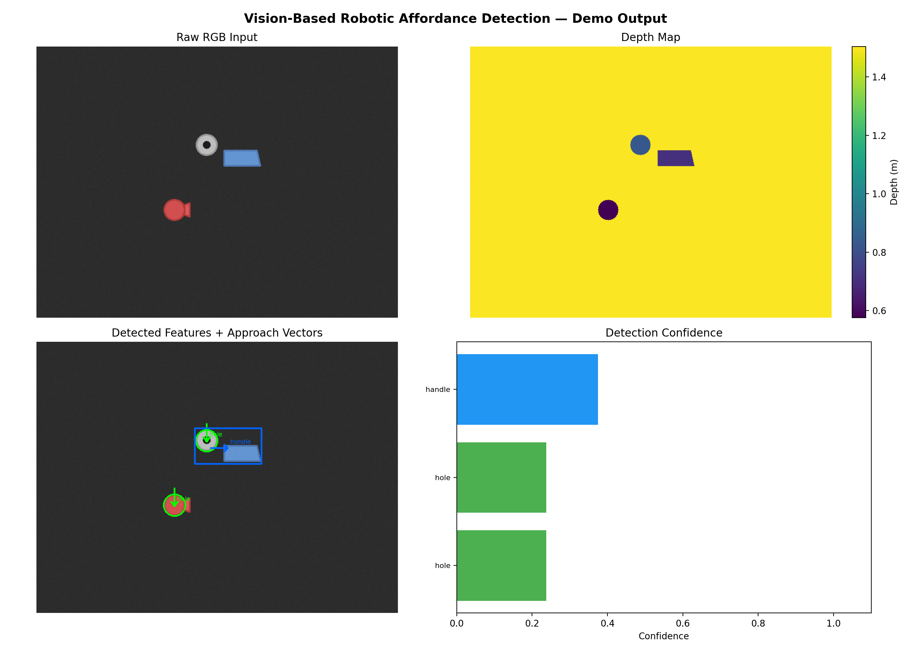

# Experiment Report — Vision-Based Robotic Affordance Detection

---

**Test Suite**: 53 passed, 0 failed out of 53 total tests

## Experiment 1: Feature Detection Accuracy

| Object | Feature | Detection Rate | Mean Pixel Error | Mean IoU | Latency (ms) |
|--------|---------|---------------|-----------------|----------|-------------|
| box | surface | 58.0% | 6.23 px | 0.000 | 49.8 |
| mug | handle | 10.0% | 99.32 px | 0.000 | 49.8 |
| washer | hole | 80.0% | 19.98 px | 0.535 | 49.8 |

---

## Experiment 2: 3D Coordinate Precision

| Object | MAE X (m) | MAE Y (m) | MAE Z (m) | Total Error (m) |
|--------|----------|----------|----------|----------------|
| box | 0.0178 | 0.0494 | 0.0215 | 0.0614 |
| mug | 0.1392 | 0.1834 | 0.0157 | 0.2523 |
| washer | 0.0161 | 0.0241 | 0.0100 | 0.0362 |

---

## Experiment 3: Robustness Analysis

### 3a — Orientation Robustness
- Mean detection rate across all orientations: **53.9%**

### 3b — Distance Robustness
- Mean detection rate across all distances: **52.5%**

### 3c — Clutter Robustness
- Mean detection rate with 3 objects: **48.3%**

---

## Parameter Sensitivity Analysis

| Parameter | Best Value | Detection Rate |
|-----------|-----------|---------------|
| canny_low | 30 | 56.7% |
| hough_param2 | 15 | 56.7% |
| surface_min_area | 500 | 56.7% |

---

## Demo Output

---

_Report generated automatically. Tests: 53/53 passing._